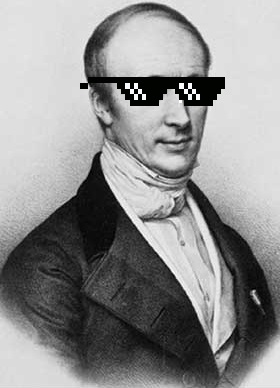

Centuries later, thanks to the efforts of several mathematicians, a precise definition of the limit was given.
Around the same time, the foundations of integral and differential calculus were based

