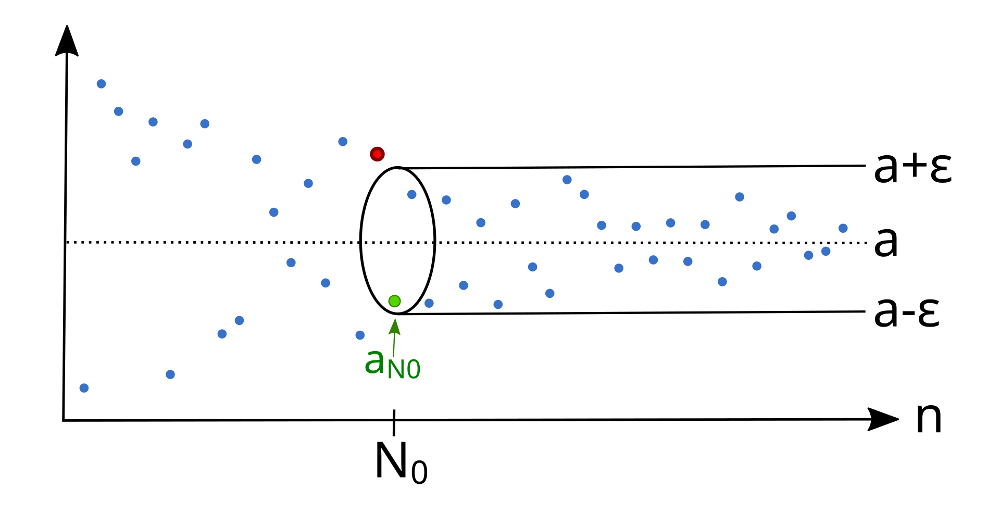

The concept of the _limit_ is fundamental in mathematics. It opened the way for differential and integral calculus.
Limits are used in calculus and mathematical analysis to find the derivatives of functions. They are also essential for defining the continuity of a function.

