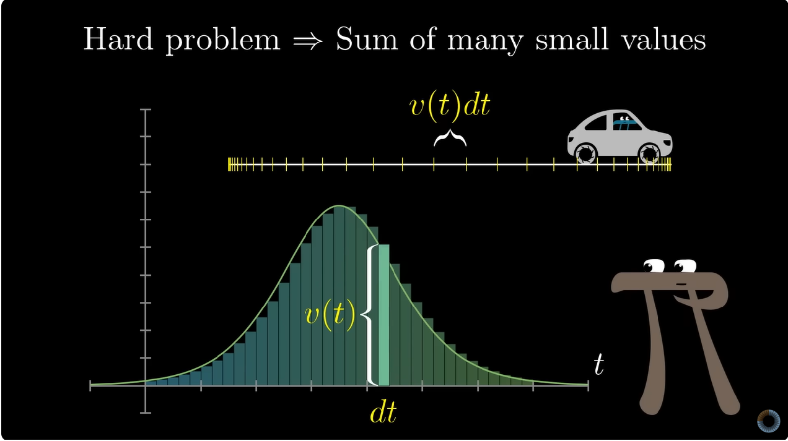

This concept made it possible to develop mathematical analysis.
It became possible to examine arbitrarily small changes in a function, thereby describing its behavior.
Limits also allowed for the development of integral calculus, connecting the graph of a function with its area.
I believe that the discovery of the limit can rightfully be called one of the greatest breakthroughs in mathematics.

