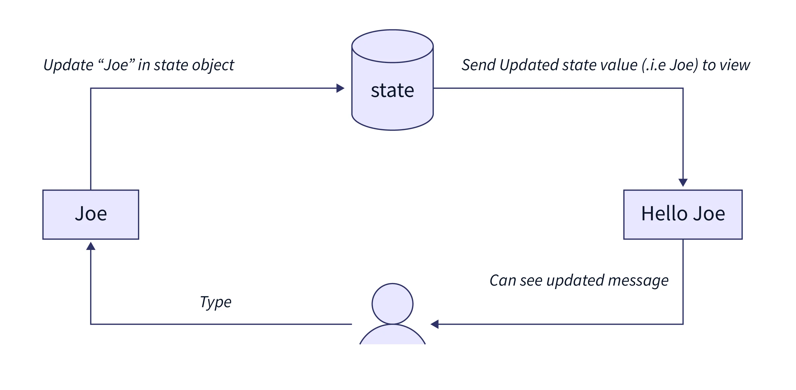

_Math is everywhere_. I think you use it even if you don't realize it.
In this article, I want to review my experience to see if math has a place in my work.

_Mathematics is beautiful_. Have you heard that before? Yes, I'm sure. And it's true.
No matter what your level of knowledge of mathematics is, you can find pretty problems and expressions in
various areas of mathematics. But what about the practical side?

> Let's take "Euler's identity" as an example.
> We won't discuss the meaning of this formula. But you can see how it relates fundamental mathematical constants to each other:
>
> ```math
> e^{i\pi} + 1 = 0
> ```

_I am a frontend developer_. Development is a field related to mathematics, of course.
But we are talking about the _frontend_. I do not do science and complex calculations.
I make user interfaces. Is there a place for mathematics in my work?

<details>
  <summary>Spoiler</summary>__I think yes.__
</details>


I think there is no point in talking about routine _calculations_.
Of course, I have to do some simple calculations when I place blocks on the page.
I also need to know what _percentages_ and _fractions_ are.
But I want to discuss a little more interesting and not obvious ideas.

_Mapping_. Mapping is a function in its general sense.
Of course, software developers use functions in their programming sense.
We use class methods or clear functions if we are writing in a
functional style(or using a [functional programming paradigm](https://en.wikipedia.org/wiki/Functional_programming)).
But modern frontend frameworks(such as [React](https://react.dev/)) are based on mapping too.
There is a mapping from state to user interface. The main idea of such frameworks is to represent the interface as
a certain state of the system first.
Then we should describe the functions that map this state to the interface shown on the screen(components).
After all the parts of our web application are described in this way, in order to change the picture on the screen,
we only need to change the state.
This may be a simple idea, but it hasn't always been the case(hello [jQuery](https://jquery.com/)).
This approach allows us to think about the state of the system and the presentation of the system separately.
And here we use mapping, a basic mathematical concept of set theory and calculus.



Continuing the conversation about state management(in the sense of front-end development),
I can't but mention _finite state machines_. This mathematical object is very close to programming.
Previously, we placed state of a web application in the foreground.
Now we can think of that state as a sequence of steps that describe a complex scenarios in our application.
We can use special libraries to manage these steps(for example [xState](https://stately.ai/docs)).
We can also visualize our code to demonstrate and understand the set of our states and their relationships.
If we do, that we take _a graph_ -- another math object studied in discrete mathematics, particularly in graph theory.


There are other examples. We can talk about linear algebra, which is used in the style language or 3D graphics.
But these are more special cases, perhaps.

The main idea of this article is that _math is everywhere_. So you use it whether you want to or not. Of course, my example is not very representative,
since my work is related to development. But perhaps you will find non-obvious examples in your professional field.

I think you can be a good frontend developer without deep knowledge of mathematics.
But _if you want to understand concepts a little deeper or create new tools that can impact the industry, mathematics is necessary_.
So, as my colleagues say, **sapere aude!**
