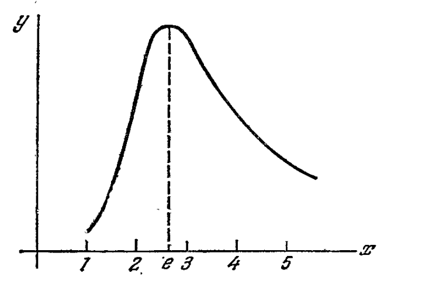

To write $1000$ numbers ($0$ to $999$) 
in decimal system we need $30$ symbols ($10$ for the position). 
In binary system we can write $2^{15}$ numbers using $30$ symbols. This is more than $1000$.

In general if we take $n$ symbols and note the base of system as $x$ count of numbers($y$) we can write be

```math
y=x^{\frac n x}
```

Let's find the maximum of this function. Let's find the maximum of this function. Find the derivative:

```math
y(x)=x^{\frac n x}\\
y'(x) - ?\\

\Bigg[  
x^{\frac n x} = e^{\frac n x \sdot \ln x}
\Bigg]\\

(e^{\frac n x \sdot \ln x})'= e^{\frac n x \sdot \ln x} \sdot \bigg({\frac n x \sdot \ln x} \bigg)'=...\\

\Bigg[\bigg({\frac n x \sdot \ln x}\bigg)'=\bigg(\frac n x \bigg)' \sdot \ln x + \frac n x \sdot (\ln x)'=
-nx^{-2} \sdot \ln x + nx^{-2}=nx^{-2}(1 - \ln x)
\Bigg]\\

...=nx^{\frac n x - 2} \sdot (1 - \ln x)\\
```


```math
\boxed{y'(x)=nx^{\frac n x - 2} \sdot (1 - \ln x)}\\
```

```math
nx^{\frac n x - 2} \sdot (1 - \ln x) = 0 \rArr x = e\\
x < e \rArr nx^{\frac n x - 2} \sdot (1 - \ln x) < 0,\\
x > e \rArr nx^{\frac n x - 2} \sdot (1 - \ln x) > 0\\

e - max
```


