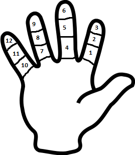

Of course, the decimal system confidently dominates others. Its popularity is due to human physiology.

The same reason can explain the popularity of duodecimal(12) numerical system and its derivatives(24, 60)
among ancient peoples. Today we can meet this base looking at analog watches.

But what about efficiency ?

